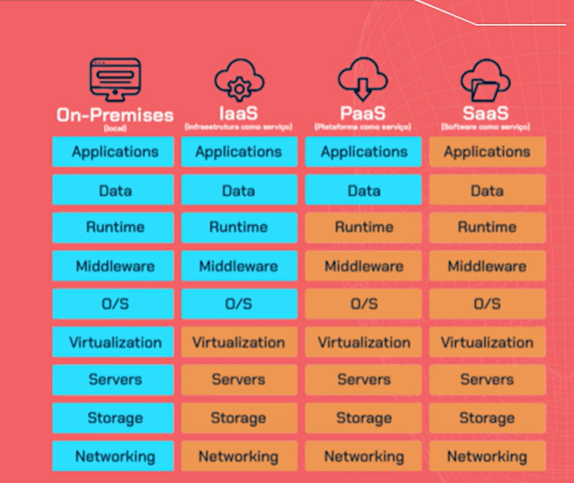

# Virtualizando recursos

* Instâncias .

Cada instância tem uma arquitetura de computador, memória, processador.  Instância é uma máquina virtual que é hospedada na infraestrutura do provedor de serviços.

É preciso também configurar um sistema operacional  para operar dentro da instância.

Além disso precisa configurar uma rede, para saber quais dispositivos de endereços de ips estará acessando dentro dela.

## Configurando regras de segurança

 A instância estará disponível na web. 

 Ficar atento ao grupos de segurânça. Eles definem as regras de acesso. 

 Regra de entrada : Todo tráfego da rede entrando na instância.

 Regra de saída : Respostas que a instância encaminha através da rede.

 ## Acessando a instância via SSH

  É preciso adicionar par de chaves primeiro. Utilizar  ED25519 . Formato de arquivo de chave privada : 
.pem

Associar os pares de chaves com a instância.

## Prepara o servidor web.

No ambiente linux, fazer atualização dos pacotes.  

Instalar o apache

-> sudo yum install httpd -y 

Habilitar o servidor

-> sudo systemctl  start httpd

## Criando um site de teste.

Front-end : Interação 
Banco de dados : Armazena os dados.
Back-end : Lógica de funcionamento

## Gerenciando serviços via AWS CLI.

Interface de linha de comando.

-> sudo apt-get install awscli

-> aws configure 

Criar chaves de acesso. 

Depois copiar a chave de acesso e colar no terminal de comando.

